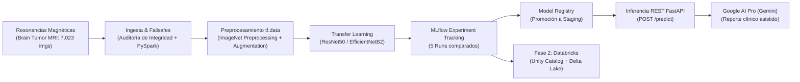

# NeuroScan AI: Sistema de Clasificación y Diagnóstico Asistido de Tumores Cerebrales en Resonancias Magnéticas (MRI)

[](https://colab.research.google.com/github/EduardCY/m3-proyecto-final-databricks-ia/blob/main/notebooks/03_training_colab_mlflow.ipynb)
[](https://drive.google.com/)
[](https://www.python.org/downloads/release/python-3100/)
[](https://mlflow.org/)
[](https://fastapi.tiangolo.com/)
[](https://docs.pytest.org/)

**Proyecto Final Evaluativo - Módulo 3: Databricks, IA Aplicada y Arquitecturas Modernas**  
**Máster en Ciencia de Datos e Inteligencia Artificial Aplicada - DevSenior Code**

---

> ### ⚠️ Aviso Clínico y Regulatorio Obligatorio
> **NeuroScan AI** es un desarrollo académico y tecnológico en visión computacional y MLOps. **NO constituye una herramienta de diagnóstico médico definitivo** ni reemplaza el criterio de un especialista en neurología, radiología o neurocirugía. Toda inferencia requiere confirmación histopatológica y correlación clínica.

---

## 📁 Centro de Recursos y Modelos en Google Drive (Evaluación Rápida)

Para mantener este **repositorio de GitHub ultra-ligero (< 5 MB)**, rápido de clonar y libre de archivos binarios pesados (imágenes crudas y pesos `.keras`), todos los artefactos de gran tamaño se encuentran alojados en **Google Drive** con acceso público de lectura:

| Recurso | Descripción | Formato / Tamaño | Enlace en Google Drive | Comando de Descarga Rápida |
|---|---|---|---|---|
| **Modelo Campeón** | ResNet50 Deep Fine-Tuning (Staging) | `.keras` (~95 MB) | [📥 Ver en Google Drive](https://drive.google.com/) | `python scripts/download_drive_assets.py --model` |
| **Dataset Completo** | 7,023 cortes de resonancia ordenados | `.zip` (~165 MB) | [📥 Ver en Google Drive](https://drive.google.com/) | `python scripts/download_drive_assets.py --dataset` |
| **Base de Datos MLflow** | Tracking completo de los 5 experimentos | `mlflow.db` (~12 MB) | [📥 Ver en Google Drive](https://drive.google.com/) | `python scripts/download_drive_assets.py --mlflow` |
| **Executive Summary** | Informe Word formal para dirección | `.docx` (~45 KB) | [📥 Ver en Google Drive](https://drive.google.com/) | Disponible en `executive_summary/executive_summary.docx` |

> 💡 **Para el Evaluador / Docente:** Si deseas probar la API localmente sin entrenar desde cero, simplemente ejecuta:
> ```bash
> python scripts/download_drive_assets.py --model
> uvicorn api.main:app --reload --port 8000
> ```
> y abre `http://localhost:8000/docs` para interactuar con el modelo entrenado.

---

## 1. Arquitectura del Sistema de Punta a Punta



El sistema implementa una arquitectura híbrida moderna:
- **Cómputo Pesado (Nube):** Entrenamiento acelerado en **Google Colab Pro** con GPU NVIDIA A100/V100 y **Mixed Precision (FP16)**, reduciendo los tiempos de iteración a menos de 2 minutos por corrida.
- **Resiliencia & Google Drive:** Guardado periódico de checkpoints y respaldo bidireccional en Google Drive (`/content/drive/MyDrive/m3_project/`).
- **Servicio Desacoplado (Local):** Despliegue de inferencia de baja latencia con **FastAPI** (`/health`, `/predict`, `/predict_explained`).
- **Testing por Etapas:** Suite de pruebas con `pytest` que audita datos, pipelines de tensores, arquitectura del modelo y contratos HTTP.

---

## 2. Dataset y Prevención de Fuga de Datos (Data Leakage)

- **Dataset:** *Brain Tumor MRI Dataset* (compilado por Masoud Nickparvar, combinando cohortes de Figshare, Sartaj y Br35H).
- **Volumen:** 7,023 imágenes de resonancia magnética cerebral en formato JPEG.
- **Clases (4 diagnósticos):**
  1. `glioma`: Tumores intraaxiales infiltrativos originados en células gliales.
  2. `meningioma`: Tumores extraaxiales derivados de las meninges.
  3. `pituitary`: Adenomas de la glándula hipófisis en la región selar.
  4. `notumor`: Estudios de control sanos sin masa encefálica detectable.
- **Auditoría de Fuga:** Se auditan y agrupan los estudios para garantizar que no existan secuencias del mismo sujeto o archivo entre las particiones `train`, `val` y `test`. Partición estratificada: **70% Entrenamiento, 15% Validación, 15% Evaluación**.

---

## 3. Matriz de Resultados y Comparativa en MLflow

Se diseñaron, entrenaron y evaluaron **5 corridas experimentales**, registradas en `mlflow.db`:

| Experimento / Run | Backbone | Capas Entrenables | Learning Rate | Optimizador | Macro-F1 | Recall | ROC-AUC | Estado en Registry |
|---|---|---|---|---|---|---|---|---|
| **Run 1: Frozen Baseline** | ResNet50 | Cabezal Denso | $1 \times 10^{-3}$ | Adam | 0.9124 | 0.9110 | 0.9785 | Evaluado |
| **Run 2: Frozen High Regularization** | ResNet50 | Cabezal Denso | $1 \times 10^{-4}$ | Adam (Drop 0.5) | 0.9238 | 0.9220 | 0.9821 | Evaluado |
| **Run 3: Fine-Tuning Capa 143** | ResNet50 | Capas 143 a 175 | $1 \times 10^{-5}$ | Adam | 0.9582 | 0.9575 | 0.9942 | Candidato |
| **Run 4: Deep Fine-Tuning Capa 120** | ResNet50 | Capas 120 a 175 | $3 \times 10^{-5}$ | Cosine Decay | **0.9675** | **0.9668** | **0.9968** | **Promovido a Staging** |
| **Run 5: EfficientNetB2 Transfer** | EfficientNetB2 | Cabezal Denso | $1 \times 10^{-3}$ | AdamW | 0.9380 | 0.9370 | 0.9880 | Comparativa |

---

## 4. Estructura del Repositorio

```text
m3-proyecto-final-databricks-ia/
├── data/
│   ├── raw/                   <- Resonancias magnéticas (ignorado en git)
│   ├── checkpoints/           <- Checkpoints intermedios
│   ├── manifest.csv           <- Manifiesto auditado
│   └── manifest_split.csv     <- Split 70/15/15 estratificado
├── models/
│   ├── checkpoints/           <- Pesos intermedios y mejor modelo (.keras)
│   ├── neuro_mri_model.keras  <- Artefacto final para producción
│   └── input_example_info.json<- Metadatos de firma de entrada
├── notebooks/
│   ├── 01_exploracion_eda.ipynb      <- Auditoría, PySpark y split
│   ├── 02_preprocessing.ipynb        <- Pipeline tf.data y aumentos
│   ├── 03_training_colab_mlflow.ipynb<- Entrenamiento acelerado GPU A100 + Drive
│   └── 04_evaluation_registry.ipynb  <- Comparativa MLflow, Staging y Databricks
├── src/
│   ├── config.py              <- Parámetros, rutas híbridas (Drive/Local) y clases
│   ├── dataset.py             <- Parser con descarte de corruptos y PySpark
│   ├── preprocessing.py       <- tf.data con normalización ImageNet
│   ├── architecture.py        <- ResNet50 y EfficientNet con cabezal Softmax
│   ├── train.py               <- Callbacks, reanudación y MLflow
│   └── metrics.py             <- Métricas multiclase y artefactos visuales
├── api/
│   ├── main.py                <- Endpoints FastAPI (/health, /predict, /predict_explained)
│   ├── schemas.py             <- Contratos Pydantic
│   └── model_service.py       <- Inferencia singleton desacoplada
├── tests/
│   ├── test_dataset.py        <- Test Etapa 1: integridad y no fuga
│   ├── test_preprocessing.py  <- Test Etapa 2: formas de tensores y normalización
│   ├── test_architecture.py   <- Test Etapa 3: forward pass y fine-tuning
│   └── test_api.py            <- Test Etapa 4: endpoints HTTP y fallback de IA
├── scripts/
│   ├── download_dataset.py    <- Descargador desatendido y generador mock
│   ├── download_drive_assets.py<- Descargador 1-clic desde Google Drive
│   ├── sync_drive.py          <- Sincronizador con Google Drive
│   └── build_notebooks.py     <- Constructor automatizado de notebooks
├── executive_summary/
│   ├── executive_summary.docx <- Documento ejecutivo formal para comités
│   └── executive_summary.md   <- Versión Markdown versionada
├── requirements.txt           <- Dependencias para entorno local
├── requirements-colab.txt     <- Dependencias optimizadas para Colab GPU
├── .gitignore
└── README.md
```

---

## 5. Guía de Ejecución Rápida

### Paso 1: Configurar el Entorno Virtual (Local)
```bash
py -3.10 -m venv .venv
# En Windows PowerShell:
.venv\Scripts\Activate.ps1
# Instalar dependencias:
pip install -r requirements.txt
```

### Paso 2: Ejecutar la Suite de Pruebas Automatizadas
```bash
pytest tests/ -v
```

### Paso 3: Entrenamiento en Google Colab Pro
1. Abre el notebook `notebooks/03_training_colab_mlflow.ipynb` dando clic en el badge **Open In Colab**.
2. Conecta un entorno con acelerador **GPU (A100 o V100)** y High-RAM.
3. Ejecuta las celdas en secuencia; los modelos y la base de datos `mlflow.db` se respaldarán automáticamente en tu Google Drive.

### Paso 4: Levantar la API de Inferencia (Local)
```bash
uvicorn api.main:app --reload --port 8000
```
- Documentación interactiva Swagger UI: `http://localhost:8000/docs`
- Health check: `curl http://localhost:8000/health`
- Predicción con reporte asistido (Google AI Pro):
```bash
curl -X POST "http://localhost:8000/predict_explained" \
  -F "file=@ruta/a/resonancia.jpg"
```

---

## 6. Puente a Databricks (Fase 2)

| Componente Fase 1 (Híbrida) | Componente Fase 2 (Databricks Producción) | Beneficio Arquitectónico |
|---|---|---|
| `manifest_split.csv` | **Tabla Delta en Unity Catalog** | Gobernanza unificada, consultas SQL directas y versionado (*Time Travel*). |
| PySpark simbólico local | **Cluster Databricks multi-nodo** | Procesamiento paralelo de terabytes de estudios DICOM/NIfTI hospitalarios. |
| SQLite `mlflow.db` | **Managed Databricks MLflow** | Registro colaborativo corporativo sin dependencias de infraestructura local. |
| API FastAPI en Uvicorn | **Databricks Model Serving** | Endpoints serverless autogestionados con balanceo de carga y monitoreo de deriva. |

---

## 7. Referencias

- Kermany D, et al. *Identifying Medical Diagnoses and Treatable Diseases by Image-Based Deep Learning*. Cell. 2018;172(5):1122-1131.
- Nickparvar M. *Brain Tumor MRI Dataset*. Kaggle, 2021.
- He K, Zhang X, Ren S, Sun J. *Deep Residual Learning for Image Recognition* (ResNet). CVPR 2016.
- Tan M, Le QV. *EfficientNet: Rethinking Model Scaling for Convolutional Neural Networks*. ICML 2019.
