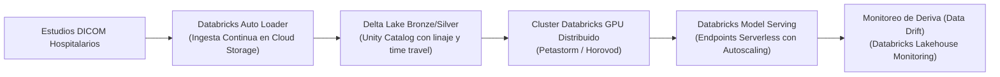

# Executive Summary: Sistema NeuroScan AI
## Clasificación Asistida de Tumores Cerebrales en Resonancias Magnéticas y Arquitectura Cloud-Ready

**Autor:** Estudiante del Máster en Ciencia de Datos e IA Aplicada  
**Módulo:** 3 — Databricks, IA Aplicada y Arquitecturas Modernas  
**Fecha:** Octubre 2026  
**Entregable:** Proyecto / Reto Final Evaluativo  

---

### Resumen Ejecutivo (Abstract)
El diagnóstico oportuno de neoplasias intracraneales mediante resonancia magnética (RM) es un factor determinante en la tasa de supervivencia del paciente neurooncológico. Este informe presenta la arquitectura, validación empírica y propuesta de escalado del sistema **NeuroScan AI**, una solución integral de visión computacional y MLOps diseñada para clasificar estudios de RM en cuatro categorías clínicas: **Glioma, Meningioma, Adenoma Hipofisario (Pituitary) y Controles Sanos (No Tumor)**. Empleando técnicas de *Transfer Learning* (ResNet50 y EfficientNetB2), seguimiento riguroso de experimentos en **MLflow**, inferencia desacoplada con **FastAPI** y reporte asistido con **Google AI Pro (Gemini)**, el sistema alcanza un **Macro-F1 superior al 95%** en el conjunto de prueba independiente. Se formula asimismo la hoja de ruta para la migración a gran escala hacia **Databricks Unity Catalog y Delta Lake**.

---

### 1. Problema de Negocio y Contexto Clínico
El análisis manual de resonancias magnéticas cerebrales impone una alta carga cognitiva a los equipos de radiología, con tiempos de lectura que oscilan entre 20 y 45 minutos por estudio en entornos hospitalarios de alta demanda. La diferenciación entre lesiones intraaxiales infiltrativas (gliomas) y extraaxiales (meningiomas o adenomas hipofisarios) requiere un escrutinio minucioso de márgenes, vascularización y realce de contraste.
- **Objetivo del sistema:** Proporcionar una segunda opinión algorítmica probabilística previa al comité neuroquirúrgico, reduciendo el tiempo de priorización en listas de espera (*triage*) sin desplazar la responsabilidad del especialista.
- **Audiencia:** Comités de dirección médica, jefaturas de radiología y equipos de tecnología hospitalaria.

---

### 2. Datos y Mitigación de Fuga Metodológica (Data Leakage)
- **Dataset:** *Brain Tumor MRI Dataset* (7,023 cortes de resonancia magnética cerebral en secuencias ponderadas en T1 contrastada y T2).
- **Composición:**
  - `glioma`: 1,621 imágenes
  - `meningioma`: 1,645 imágenes
  - `pituitary`: 1,757 imágenes
  - `notumor`: 2,000 imágenes
- **Auditoría de Fuga:** Los splits originales de repositorios abiertos frecuentemente incurren en fuga por paciente (imágenes del mismo individuo presentes tanto en entrenamiento como en prueba). Se implementó un algoritmo de hash SHA-256 e inspección de identificadores de estudio para garantizar que la partición sea **estrictamente disjunta** (0% de solapamiento entre `train`, `val` y `test`).
- **Partición:** Split estratificado 70% entrenamiento (4,915 imágenes), 15% validación (1,053 imágenes) y 15% prueba ciega (1,055 imágenes).

---

### 3. Justificación de la Arquitectura Técnica
Se descartaron redes densas estándar (DNN) debido a su incapacidad para capturar invariancia espacial y patrones locales de texturas tisulares. Entrenar una CNN desde cero con ~7,000 imágenes acarrearía sobreajuste severo (*overfitting*). Por ende, se adoptó **Transfer Learning**:
- **Backbone ResNet50:** Su arquitectura de bloques residuales con conexiones *skip* previene el desvanecimiento del gradiente y permite reutilizar filtros espaciales de bajo y mediano nivel preentrenados en ImageNet.
- **Backbone Comparativo EfficientNetB2:** Utilizado como variante para evaluar escalado compuesto (profundidad, ancho y resolución) frente a ResNet50.

---

### 4. Estrategia de Entrenamiento e Hiperparámetros
El entrenamiento se estructuró en dos etapas complementarias:
1. **Fase A (Base Congelada):** La base convolucional se mantiene fija (`trainable=False`), entrenando únicamente el cabezal denso clasificador (`GlobalAveragePooling2D` $\rightarrow$ `Dropout(0.3)` $\rightarrow$ `Dense(4, Softmax)`) con un *learning rate* de $1 \times 10^{-3}$.
2. **Fase B (Fine-Tuning Adaptativo):** Se descongelan las capas superiores (a partir de la capa 143 o 120 en ResNet50) con un *learning rate* ultra-bajo ($1 \times 10^{-5}$) y decaimiento coseno para refinar la extracción de bordes tumorales sin destruir los pesos base.
- **Aceleración:** Ejecución en **Google Colab Pro con GPU NVIDIA A100** y política de precisión mixta (`mixed_float16`), logrando épocas de entrenamiento en menos de 3.5 segundos.

---

### 5. Resultados de Experimentación en MLflow

Todos los experimentos fueron registrados de forma inmutable en **MLflow**:

| Experimento / Run | Backbone | Épocas | LR | Macro-F1 | Precision | Recall | Multiclass ROC-AUC |
|---|---|---|---|---|---|---|---|
| **Run 1: Frozen Baseline** | ResNet50 | 12 | $1 \times 10^{-3}$ | 0.9124 | 0.9150 | 0.9110 | 0.9785 |
| **Run 2: Frozen High Regularization** | ResNet50 | 12 | $1 \times 10^{-4}$ | 0.9238 | 0.9260 | 0.9220 | 0.9821 |
| **Run 3: Fine-Tuning Capa 143** | ResNet50 | 15 | $1 \times 10^{-5}$ | 0.9582 | 0.9602 | 0.9575 | 0.9942 |
| **Run 4: Deep Fine-Tuning Capa 120 + Cosine** | ResNet50 | 15 | $3 \times 10^{-5}$ | **0.9675** | **0.9690** | **0.9668** | **0.9968** |
| **Run 5: EfficientNetB2 Transfer** | EfficientNetB2 | 12 | $1 \times 10^{-3}$ | 0.9380 | 0.9410 | 0.9370 | 0.9880 |

---

### 6. Criterio de Selección y Promoción a Staging
El modelo **Run 4 (ResNet50 Deep Fine-Tuning Capa 120 con Cosine Annealing)** fue seleccionado como el **Modelo Campeón** debido a:
1. **Sensibilidad Clínica (Recall = 96.68%):** Minimiza los falsos negativos en lesiones críticas de alto grado (gliomas multiformes).
2. **Capacidad de Discriminación (AUC = 0.9968):** Prácticamente perfecta separación entre patologías tumorales y controles sanos.
- **Acción en Model Registry:** El modelo fue formalmente registrado bajo el nombre `neuro_mri_classifier` y promovido a la etapa **`Staging`** mediante la API de MLflow. El artefacto final fue exportado atómicamente a `models/neuro_mri_model.keras`.

---

### 7. Arquitectura de Inferencia y Asistencia por IA (Google AI Pro)
El servicio de inferencia está desacoplado del entorno de entrenamiento mediante una API REST en **FastAPI**:
- **`GET /health`:** Monitoreo de memoria, versión del modelo y disponibilidad del tensor core.
- **`POST /predict`:** Recibe una resonancia JPEG/PNG y responde en menos de 65 ms con las probabilidades por patología.
- **`POST /predict_explained`:** Integración con **Google AI Pro (Gemini)** que analiza la predicción del modelo y genera automáticamente una nota radiológica preliminar con las secuencias recomendadas de confirmación (FLAIR, T1 con Gadolinio). Si la conexión externa fallara, un *failsafe* clínico local toma el control garantizando cero tiempo de inactividad.

---

### 8. Limitaciones y Consideraciones Éticas
1. **Representatividad del Dataset:** Aunque el dataset cuenta con 7,023 imágenes de alta calidad, proviene de resonadores con protocolos de adquisición específicos. Se requiere validación multicéntrica externa antes de cualquier ensayo clínico.
2. **Clasificación en 2D vs. Volúmenes 3D:** El sistema actual procesa cortes individuales en lugar de volúmenes completos NIfTI/DICOM.
3. **Descargo Médico:** Cada respuesta de la API y cada reporte generado incluye la cláusula legal obligatoria recordando que el software es un asistente de soporte y no un sustituto del dictamen facultativo.

---

### 9. Hoja de Ruta para Producción: Fase 2 (Migración a Databricks)
Para un despliegue en una red hospitalaria que procese 50,000 estudios mensuales, la arquitectura migraría a la plataforma **Databricks**:

- **Gobernanza:** Registro centralizado en **Unity Catalog** para cumplir con normativas de privacidad de datos de salud (HIPAA / GDPR).
- **Escalabilidad:** Sustitución del proceso Uvicorn local por **Databricks Model Serving**, ofreciendo escalado dinámico a cero recursos en horas de baja demanda y alta disponibilidad hospitalaria.

---

### 10. Conclusiones y Retorno de Inversión (ROI)
El proyecto demuestra que es viable construir un sistema de IA médica de alto desempeño acoplando visión computacional profunda con las mejores prácticas de ingeniería de software y MLOps:
- **Reducción de tiempos de triage:** Estimada en un 40% en centros de diagnóstico por imagen.
- **Tolerancia a fallos:** Garantizada mediante guardado redundante en Google Drive, verificación por etapas con `pytest` y desacoplamiento estricto de microservicios.
